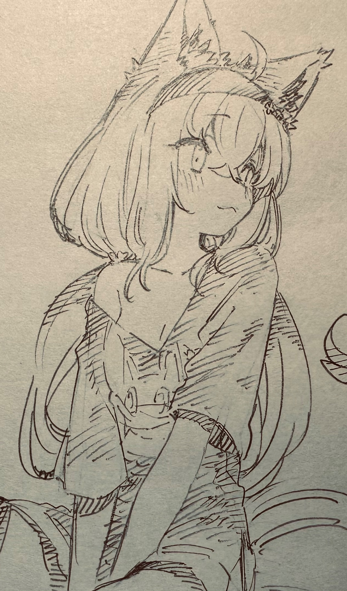

  
  

    
       
    

      🌟 Hey there, I'm Maxime - AKA KazaWai 👋
    

    

      Welcome to my GitHub profile! I'm a CompSci student with a passion for embedded systems, telecommunication technologies, and space technologies. I love to learn and experiment with new technologies and concepts.
    

    

      🚀 About Me 
        - 🎓 Studying: Computer Sciences at the University of Mons, Belgium & University of Vaasa, Finland 
        - 🎯 Passionate about: Embedded Systems, Telecommunication technologies and protocols, and space technologies ! 
        - 📚 Learning: Everthing ! With a focus on what I like of course 👨‍🚀 
      ------------------- 
      💡 Fun Facts 
        - 🌱 Hobbies: Drawing, Rock Climbing, Reading and Riding my bikes. 
        - 🧩 Free time: Currently exploring PCB Designing in my free time. 
        - 🧘 Balance: When not coding, I love spending time talking with my friends all over the world and drawing along. 
    

  

  
  
kazawai

